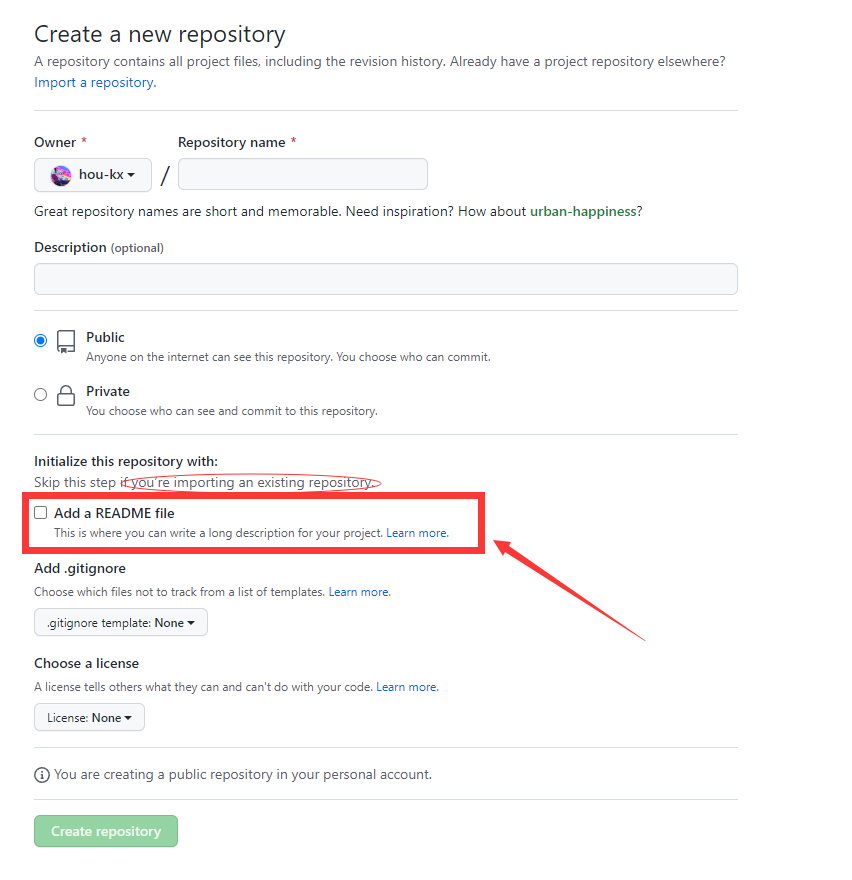
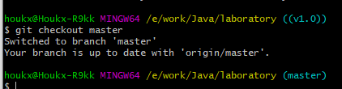

# git 使用
## 1 准备工作， git bash 中操作
### 1.1 ssh-key
```sh
# 为账户（登录邮箱）创建一个 key, 可以设置 ssh-key 的密码，这样，每次第一次使用 git bash 需要输入密码
# 生成成功后 在windows本地 ~\.ssh\id_rsa.pub 记事本打开复制到：
# github ->  settings -> SSH keys -> New SSH key
ssh-keygen -t rsa -C "your login email"
```
## 1.2 配置 远程仓库用户名，邮箱
```sh
git config --list
git config --global user.name "your username"
git config --global user email "your email"
```
## 2 常用的 git 命令
```sh
git --help # 查看帮助
git init # 再本地创建仓库，在当前文件夹下生成 .git文件夹
git add ....  # 添加待提交文件
git commit -m "my first commit" # 提交到本地仓库
git push -u origin master # 将提交到本地的commint 提交到远程仓库origin 的 master 分支去
# #####################
git remote add origin git@github.com:hou-kx/hou-kx.git # 本地创建远程仓库映射 origin 
git remote set-url origin git@github.com:hou-kx/hou-kx.git # 修改为新的远程仓库地址
git remote -vv # 查看所有的远程仓库
git remote rename origin old-origin # 给现有的远程仓库地址重命名
git tag     # 列出已有的tag
git log     # 查看所有的commit提交记录
git show    # 查看提交的详情
git status   # 查看当前操作情况，如果已经提交到本地，则无法在看
git branch -a   # 所有分支
git branch -v   # 分析
git branch -vv  # 本地和远程的关系
git clone git@github.com:hou-kx/hou-kx.git # clone 远程仓库到当前本地文件夹
```

## 3 创建远程仓库，上传代码
### 3.1两种情况
#### 3.1.1 创建空的远程仓库，本地项目代码已经存在只需要上传
**不能选择 add a README file**，否则本地上传的时候，会出现冲突，需要合并，较为麻烦，直接创建一个空的远程仓库。

#### 3.1.2 如果本地没有的话这种就比较随意了，创建完成后，clone 到本地，然后直接用即可

### 3.2创建远程仓库 laboratory
本地的项目文件夹根目录打开 git bash
```sh
# 1. 如果本地没有代码，下面代码可以直接 clone 使用
echo "# hou-kx" >> README.md
git init
git add README.md
git commit -m "first commit"
git branch -M master
git remote add origin git@github.com:hou-kx/hou-kx.git
git push -u origin master

# 2.如果本来有代码
git init
git add ./*
git commit -m "first commit"
# 这一步可省略，最终提交到 master 会自动创建
# git branch -M master
git remote add origin git@github.com:hou-kx/hou-kx.git
git push -u origin master
```

## 4. tag 使用

```sh
# 轻量标签（lightweight）tags意味着一个私有的、临时的标签。
# 创建lightweight类型的tag：
git tag v1.0 -lw

# 附注标签（annotated）tags意味着一次正式的发布。
# 创建annotated类型的tag： 加上-a参数来创建一个带备注的tag，备注信息由-m指定
git tag -a v1.0  -m "my version v1.0"
git checkout  # +某版本号切换到 版本号下，或者【分支名】切换到分支下

git tag     # 列出已有的tag

git tag -a v1.2 9fceb02 -m "my tag"  # 给指定的某个commit(Hash)号加tag
git push origin v1.0    # 将tag同步到远程服务器

git push origin --tags  # 推送所有tag：
```

## 5.  branch、tag、release

### 5.1 branch、tag
> tag 对应某次 commit, 是一个点，是不可移动的。
> branch 对应一系列 commit，是很多点连成的一根线，有一个HEAD 指针，是可以依靠 HEAD 指针移动的。
> 
> ag 和 branch 的相互配合使用，例如 已经发布了 v1.0 v2.0 v3.0 三个版本，
> 我突然想不改现有代码的前提下，在 v2.0 的基础上加个新功能，作为 v4.0 发布。检出 v2.0 的代码作为一个 branch ，然后作为开发分支。
### 5.2 tag、release
> 标签是git中的概念，而release则是Github、码云等源码托管商所提供的更高层的概念。
> Release是源码托管商对git的tag功能的增强。
> 创建release，则需要通过源码托管商的网页操作界面来进行，一般会要求填写tag名、分支以及相应的发布说明
> Release是源码托管商对git的tag功能的增强。通过git提供的tag功能，我们可以给项目进行版本标识，以识别特定的版本，